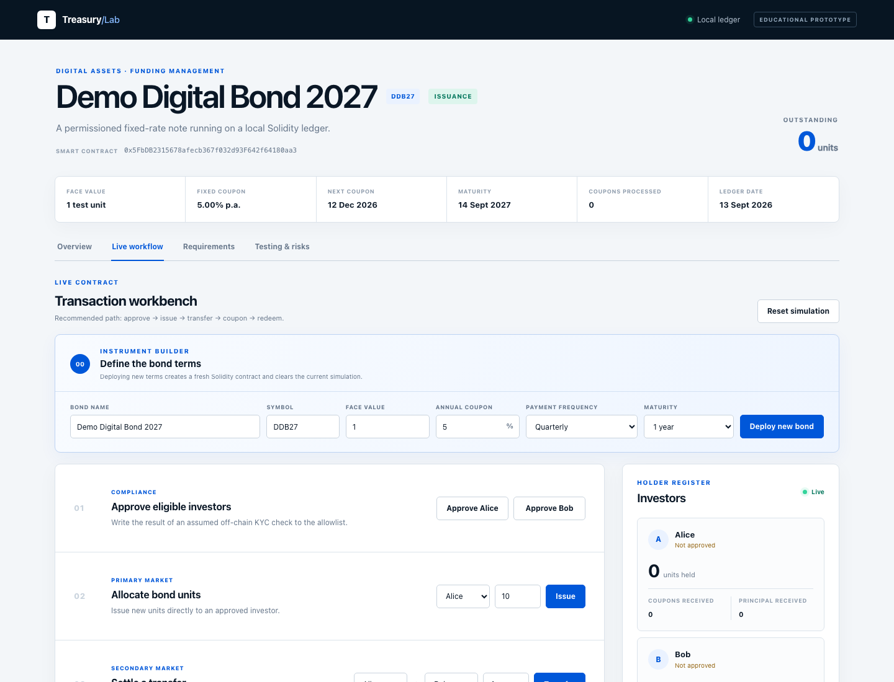

# Permissioned Tokenized Bond Prototype

[](https://render.com/deploy?repo=https://github.com/johnhz0229/digitalbonddlt)

An educational Solidity prototype showing the lifecycle of a simple fixed-rate digital bond: investor whitelisting, issuance, permissioned transfer, coupon payment, redemption funding and principal repayment.

The project is designed as a capital-markets learning exercise and as evidence of requirements engineering, implementation and testing. It is **not production-ready, not audited, not legal advice and not an investment product**. Native test-network currency is used only as a stand-in for cash.

## Business scenario

A corporate or bank issuer creates a one-year bond with a fixed face value and annual coupon. Only investors who have passed an assumed off-chain KYC process may receive or transfer units. Coupon payments follow a fixed schedule. At maturity, the issuer funds principal and investors redeem their units.

## Implemented scope

- Issuer-controlled investor whitelist
- Issuance to approved investors
- Permissioned transfers between approved investors
- Fixed coupon calculation using basis points
- Scheduled coupon distribution
- Maturity check and redemption funding
- Investor-initiated principal redemption and token burn
- Events for an auditable lifecycle trail
- Automated positive and negative tests

## Quick start

Requirements: Node.js 20 or newer and npm.

```bash
npm install
npm test
```

## Interactive dashboard



Start the browser-based lifecycle demo with one command:

```bash
npm run demo
```

The dashboard opens automatically at `http://127.0.0.1:3000`. No wallet,
browser extension, public blockchain or real currency is required. Each button
executes a real transaction against the Solidity contract on Hardhat's local
in-memory ledger. Follow the five numbered steps from KYC whitelisting through
issuance, transfer, coupon payment and maturity redemption. Press `Ctrl+C` in
the terminal when finished.

The four dashboard views support an interview walkthrough:

- **Overview** frames the business problem and compares conventional and DLT processes.
- **Live workflow** executes the permissioned bond lifecycle on the local ledger.
- **Requirements** maps business rules to user outcomes, contract functions and tests.
- **Testing & risks** documents acceptance evidence and production-readiness gaps.

In **Live workflow**, the Instrument Builder can deploy a fresh contract with a
custom bond name, symbol, face value, annual coupon, payment frequency and
maturity. All later issuance, coupon and redemption results use the selected
terms.

## Public deployment

The demo is prepared for a Node.js 20 web service. Each browser receives an
isolated in-memory ledger identified by an HTTP-only session cookie; inactive
ledgers expire after 30 minutes, and no wallet, private key or real asset is
accepted from the visitor.

For Render, push the repository to GitHub and create a new Blueprint from the
included `render.yaml`. Render installs only runtime dependencies, uses the
verified contract artifact, checks `/health` and provides an HTTPS URL. A standard `Dockerfile` is also
included for Railway, Fly.io or another container host.

Cloud demo state is intentionally temporary. A service restart or idle-session
expiry creates a fresh ledger, which is appropriate for this educational use
case.

Optional local deployment:

```bash
npx hardhat node
npm run deploy:local
```

## Example terms

The deployment script creates a demo bond with:

- face value: 1 unit of test currency per bond unit;
- annual coupon: 5.00%;
- coupon interval: 90 days;
- maturity: approximately one year after issuance.

The periodic coupon is calculated as:

```text
face value × annual coupon rate × coupon interval / 365 days
```

## Repository structure

```text
contracts/TokenizedBond.sol       Smart contract
test/TokenizedBond.test.js        Automated acceptance and unit tests
scripts/deploy.js                 Local deployment example
scripts/demo-server.js            Local ledger and dashboard API
public/                            Interactive browser dashboard
docs/USER_STORIES.md              Requirements and acceptance criteria
docs/PROCESS_COMPARISON.md        Traditional vs. DLT lifecycle comparison
```

## Deliberate simplifications and risks

This prototype keeps a holder array and pushes coupons to all holders. That is readable for a small demonstration but does not scale and can fail if a recipient contract rejects payment. A real implementation would normally use record-date snapshots and claim-based payments.

Other omitted production requirements include:

- formal role-based access control and multisignature governance;
- legally binding investor identity and KYC/AML integration;
- a regulated cash token or external payment-versus-delivery mechanism;
- pause, recovery, forced transfer and key-loss processes;
- day-count conventions, business-day calendars and precise coupon schedules;
- privacy, data protection and regulatory reporting;
- upgrade governance, external security audit and operational monitoring;
- connection to trading, custody, CSD and treasury systems.

These limitations are intentional discussion points: the prototype demonstrates how business requirements can become user stories, Solidity rules and automated tests without presenting a classroom example as bank-ready infrastructure.

## Suggested interview walkthrough

1. Start with the business process and why the whitelist is off-chain/on-chain hybrid.
2. Map each user story to a contract function and its automated test.
3. Demonstrate that invalid permissions, early payments and incorrect amounts revert.
4. Explain why production coupon distribution needs snapshots and a pull-payment model.
5. Discuss legal ownership, settlement finality, privacy and integration as equally important parts of a bank solution.

## License

MIT, for educational use. No warranty is provided.
