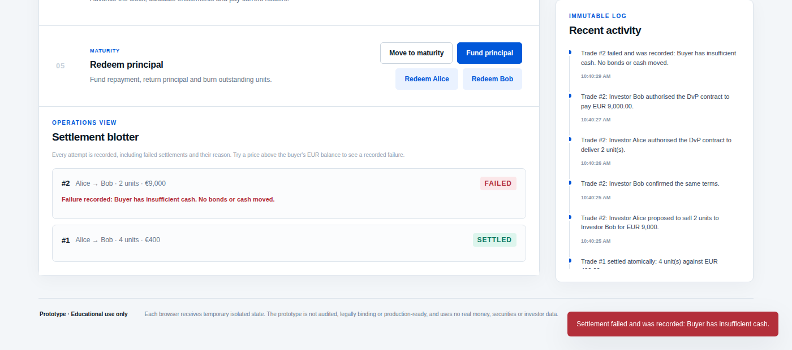

# Permissioned Tokenized Bond Prototype

[](https://render.com/deploy?repo=https://github.com/johnhz0229/digitalbonddlt)

This is an educational Solidity prototype made during my spare time showing the lifecycle of a simple fixed-rate digital bond: investor whitelisting, issuance, delivery-versus-payment (DvP) settlement against a tokenised euro, coupon payment, redemption funding and principal repayment.

## Business scenario

A corporate or bank issuer creates a one-year bond with a fixed face value and annual coupon. Only investors who have passed an assumed off-chain KYC process may receive or transfer units. Coupon payments follow a fixed schedule. At maturity, the issuer funds principal and investors redeem their units.

## Implemented scope

- Issuer-controlled investor whitelist
- Issuance to approved investors
- Permissioned transfers between approved investors
- Atomic DvP settlement of bond units against a demo tokenised euro (`DvPSettlement`)
- Recorded settlement failures with a reason (missing cash, bonds, authorisation or KYC status), so operations sees every attempt
- Coupon servicing as payment versus discharge: a coupon claim fixed at the record date is discharged only when the bond accepts the success preimage released after the cash moved; a failure closes the attempt but keeps the claim
- Cross-chain DvP without time-locks, simplified from ERC-7573 (Fries, Kohl-Landgraf; draft): the bond is locked on an asset chain against two key hashes, the payment chain decides which encrypted key a stateless decryption oracle releases
- Fixed coupon calculation using basis points
- Scheduled coupon distribution
- Maturity check and redemption funding
- Investor-initiated principal redemption and token burn
- Events for an auditable lifecycle trail
- Automated positive and negative tests

## Quick start

Requirements: Node.js 20 or newer and npm.

```bash
npm install
npm test
```

## Interactive dashboard



Start the browser-based lifecycle demo with one command:

```bash
npm run demo
```

The dashboard opens automatically at `http://127.0.0.1:3000`. No wallet,
browser extension, public blockchain or real currency is required. Each button
executes a real transaction against the Solidity contract on Hardhat's local
in-memory ledger. Follow the five numbered steps from KYC whitelisting through
issuance, DvP trade, coupon payment and maturity redemption. The settlement
blotter shows every trade, its pre-check result, and the reason for any failure. Press `Ctrl+C` in
the terminal when finished.

The four dashboard views support an interview walkthrough:

- **Overview** frames the business problem and compares conventional and DLT processes.
- **Live workflow** executes the permissioned bond lifecycle on the local ledger.
- **Requirements** maps business rules to user outcomes, contract functions and tests.
- **Testing & risks** documents acceptance evidence and production-readiness gaps.

In **Live workflow**, the Instrument Builder can deploy a fresh contract with a
custom bond name, symbol, face value, annual coupon, payment frequency and
maturity. All later issuance, coupon and redemption results use the selected
terms.

## Cross-chain DvP (ERC-7573 style)

When the bond and the cash live on different ledgers, there is no shared
transaction to make settlement atomic. This prototype follows the idea of
ERC-7573:

1. Each party generates the *other* party's key, so nobody holds the key that
   would benefit themselves.
2. The asset chain locks the bond against the hashes of both keys.
3. The payment chain stores both keys encrypted for an oracle. A successful
   payment requests the buyer's key; a failed or cancelled payment requests the
   seller's key. Only one key is ever requested.
4. A stateless oracle decrypts that one key and publishes it. Whoever submits
   it on the asset chain moves the bond in the direction the key encodes.

Run it on two separate local ledgers in the terminal (success, failed payment
and cancellation):

```bash
npm run crosschain
```

or step through it in the dashboard's **Cross-chain DvP** tab, which shows both
ledgers and who knows which key at each step.

## Coupon: payment versus discharge

A reported "paid" status should not be enough to wipe out an investor's claim.
`CouponDischarge` fixes each holder's claim at the record date, then for each
settlement attempt freezes the hashes of a success key and a failure key that
the oracle generated (and immediately forgot, as in the March 2026 DZ BANK /
KfW Smart Bond Contract pilot). The cash moves on the payment ledger; the
oracle reveals one key; the bond:

- discharges the claim only when it accepts the success preimage;
- closes the attempt but keeps the claim open on a failure preimage;
- treats a repeated forward of the same key as a no-op, so connectors can retry.

```bash
npm run coupon
```

or use the dashboard's **Coupon discharge** tab. This is an educational reading
of the abstract of Fries, Kohl-Landgraf and Prandtl (2026), "Participant-Operated
Settlement Connectors for Digital Bonds", not an implementation of the paper.

## Public deployment

The demo is prepared for a Node.js 20 web service. Each browser receives an
isolated in-memory ledger identified by an HTTP-only session cookie; inactive
ledgers expire after 30 minutes, and no wallet, private key or real asset is
accepted from the visitor.

For Render, push the repository to GitHub and create a new Blueprint from the
included `render.yaml`. Render installs only runtime dependencies, uses the
verified contract artifact, checks `/health` and provides an HTTPS URL. A standard `Dockerfile` is also
included for Railway, Fly.io or another container host.

Cloud demo state is intentionally temporary. A service restart or idle-session
expiry creates a fresh ledger, which is appropriate for this educational use
case.

Optional local deployment:

```bash
npx hardhat node
npm run deploy:local
```

## Example terms

The deployment script creates a demo bond with:

- face value: 1 unit of test currency per bond unit;
- annual coupon: 5.00%;
- coupon interval: 90 days;
- maturity: approximately one year after issuance.

The periodic coupon is calculated as:

```text
face value × annual coupon rate × coupon interval / 365 days
```

## Repository structure

```text
contracts/TokenizedBond.sol       Permissioned bond contract
contracts/TokenisedEuro.sol       Demo cash token (stand-in for a tokenised deposit or wholesale CBDC)
contracts/DvPSettlement.sol       Delivery-versus-payment between bond and cash token
test/TokenizedBond.test.js        Bond lifecycle tests
test/DvPSettlement.test.js        DvP tests, one block per acceptance criterion
contracts/AssetLockingContract.sol       Asset-chain side of cross-chain DvP (ERC-7573 style)
contracts/PaymentDecryptionContract.sol  Payment-chain side: pays and requests one key
scripts/lib/erc7573.js            Key documents, encryption and the stateless decryption oracle
scripts/lib/crosschain-scenario.js Two-ledger protocol used by the terminal demo and dashboard
scripts/crosschain-demo.js        Terminal walkthrough of three cross-chain scenarios
test/CrossChainDvP.test.js        Cross-chain success, failure, cancellation and attack tests
contracts/CouponDischarge.sol     Coupon claims discharged only by an accepted success preimage
scripts/lib/coupon-scenario.js    Two-ledger coupon protocol used by the terminal demo and dashboard
scripts/coupon-demo.js            Terminal walkthrough: paid coupon, and failure followed by a retry
test/CouponDischarge.test.js      Record date, discharge, retry, idempotent forwarding, forgery tests
docs/learn/01-dvp.md              Study notes: DvP from business problem to code (Chinese)
docs/learn/03-crosschain-dvp.md   Study notes: cross-chain DvP and ERC-7573 (Chinese)
docs/learn/04-coupon-discharge.md Study notes: payment versus discharge and the 2026 pilot (Chinese)
scripts/deploy.js                 Local deployment example
scripts/demo-server.js            Local ledger and dashboard API
public/                            Interactive browser dashboard
docs/USER_STORIES.md              Requirements and acceptance criteria
docs/PROCESS_COMPARISON.md        Traditional vs. DLT lifecycle comparison
```

## Deliberate simplifications and risks

This prototype keeps a holder array and pushes coupons to all holders. That is readable for a small demonstration but does not scale and can fail if a recipient contract rejects payment. A real implementation would normally use record-date snapshots and claim-based payments.

Other omitted production requirements include:

- formal role-based access control and multisignature governance;
- legally binding investor identity and KYC/AML integration;
- a legally backed cash leg (the demo tokenised euro has none) or a trigger to central bank money in T2;
- a production oracle (threshold decryption, key management) and real ledger connectivity for cross-chain DvP;
- pause, recovery, forced transfer and key-loss processes;
- day-count conventions, business-day calendars and precise coupon schedules;
- privacy, data protection and regulatory reporting;
- upgrade governance, external security audit and operational monitoring;
- connection to trading, custody, CSD and treasury systems.

These limitations are intentional discussion points: the prototype demonstrates how business requirements can become user stories, Solidity rules and automated tests without presenting a classroom example as bank-ready infrastructure.

## Suggested interview walkthrough

1. Start with the business process and why the whitelist is off-chain/on-chain hybrid.
2. Map each user story to a contract function and its automated test.
3. Demonstrate that invalid permissions, early payments and incorrect amounts revert.
4. Explain why production coupon distribution needs snapshots and a pull-payment model.
5. Discuss legal ownership, settlement finality, privacy and integration as equally important parts of a bank solution.

## License

MIT, for educational use. No warranty is provided.
